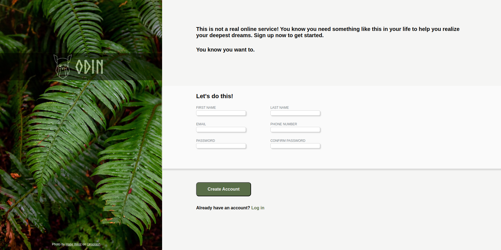

# <a href="https://a07k.github.io/Project-Sign-up-Form/">Sign Up Form</a>

  <h2>Description</h2>
    
This project is a simple sign-up form page implemented using HTML and CSS. It features a split-screen design with an image section and a form section.

  <h2>Features</h2>
    <ul>
        <li>Responsive layout with image and form sections</li>
        <li>Input fields for first name, last name, email, phone number, and password</li>
        <li>Password confirmation field</li>
        <li>"Create Account" button</li>
        <li>Login option for existing users</li>
    </ul>
    <h2>Structure</h2>
    <ul>
        <li>Left side: Image section with Odin Project logo</li>
        <li>Right side: 
            <ul>
                <li>Introduction text</li>
                <li>Sign-up form</li>
                <li>Submission button</li>
                <li>Login link for existing users</li>
            </ul>
        </li>
    </ul>
    <h2>Technologies Used</h2>
    <ul>
        <li>HTML5</li>
        <li>CSS3</li>
    </ul>
    <h2>Setup</h2>
    
To use this project, simply open the HTML file in a web browser. Ensure that the referenced CSS file (style.css) and JavaScript file (script.js) are in the correct directory relative to the HTML file.

    <h2>Note</h2>
    
This is a front-end only implementation and does not include actual form submission functionality.

